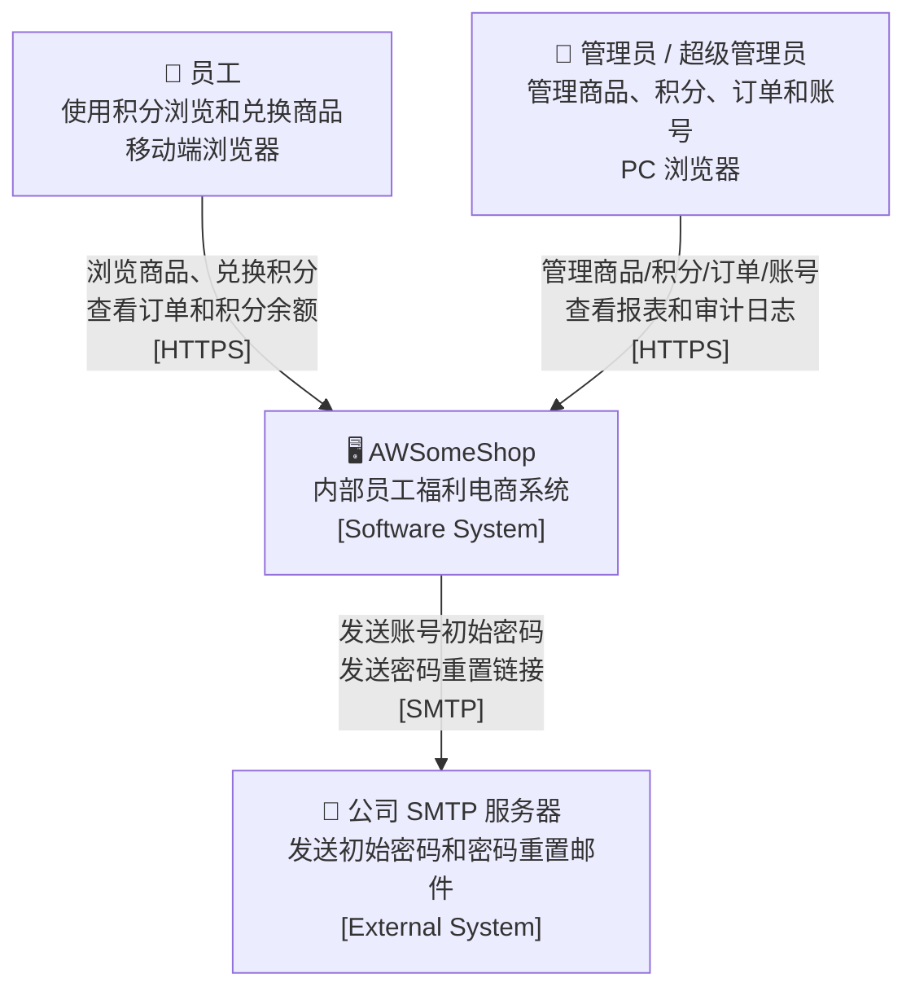
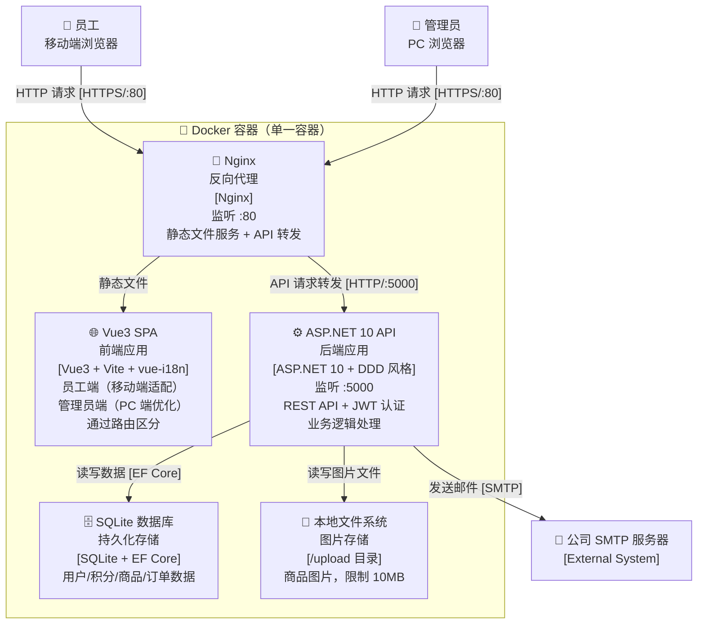
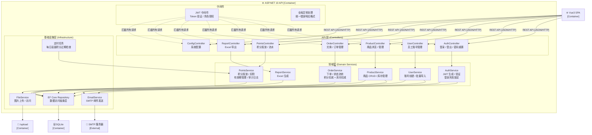
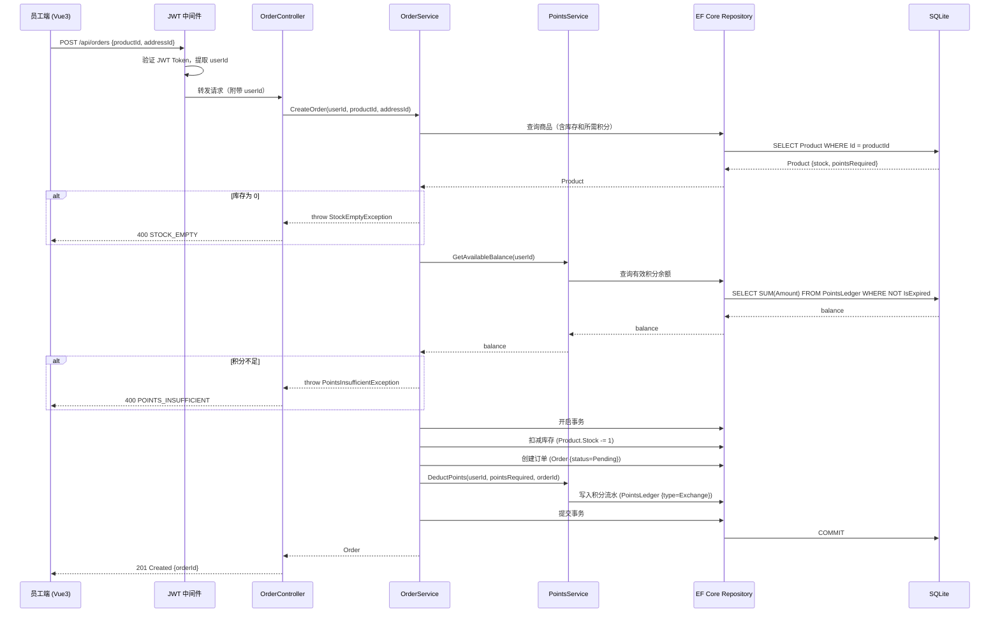
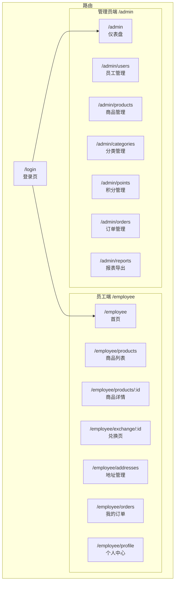
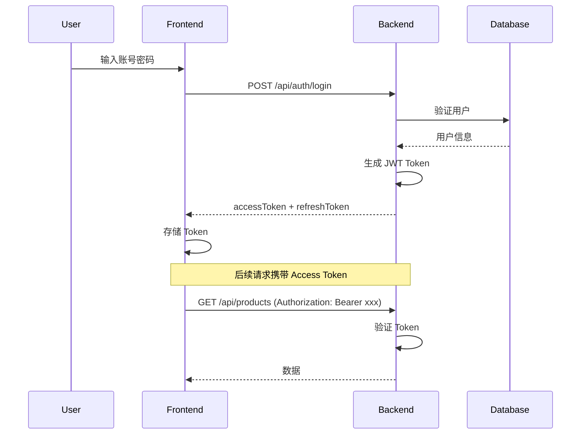
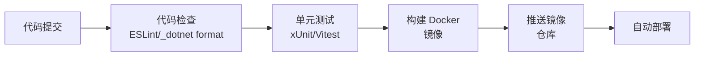

# AWSomeShop 设计文档

## 1. 概述

AWSomeShop 是一个面向内部员工的福利电商平台，通过积分兑换机制实现员工福利发放。系统采用前后端分离架构，前端使用 Vue3 SPA，后端使用 ASP.NET 10 REST API，数据库采用 SQLite。

### 1.1 系统目标

- 为员工提供便捷的积分兑换商品体验
- 为管理员提供完整的商品、积分、订单管理功能
- 支持中英文国际化
- 满足移动端和 PC 端的不同使用场景

### 1.2 技术栈

| 层级 | 技术选型 |
|------|----------|
| 前端 | Vue3 + vue-i18n + Vite |
| 后端 | ASP.NET 10 + REST API + DDD 风格 |
| 数据库 | SQLite + Entity Framework Core |
| 认证 | JWT Token (Access Token 2h + Refresh Token 30d) |
| 图片存储 | 本地文件系统 (/upload 目录，限制 10MB) |
| 邮件服务 | 公司 SMTP 服务器 |
| 部署 | Docker 容器（单一容器） |
| CI/CD | GitHub Actions |

---

## 2. 系统架构设计（C4 Model）

### 2.1 Level 1 — System Context（系统上下文图）

> 展示 AWSomeShop 与外部用户和外部系统的关系。



---

### 2.2 Level 2 — Container（容器图）

> 展示 AWSomeShop 内部的可部署单元（容器）及其交互关系。



---

### 2.3 Level 3 — Component（组件图）

> 展示后端 ASP.NET 10 应用内部的主要组件及其职责。



---

### 2.4 Level 4 — Code（关键流程时序图）

> 展示核心业务流程的代码级交互：商品兑换流程。



---

### 2.5 模块划分

| 模块 | 职责 | 主要功能 |
|------|------|----------|
| 用户模块 | 员工和管理员账号管理 | 登录、注册、密码重置、账号管理 |
| 积分模块 | 积分发放、扣除、有效期管理 | 积分调整、流水记录、过期检查 |
| 商品模块 | 商品和分类管理 | 商品 CRUD、分类管理、上下架 |
| 订单模块 | 兑换订单处理 | 下单、状态流转、地址管理 |
| 管理模块 | 系统配置和报表 | 导出 Excel、审计日志、系统配置 |

---

## 3. 数据模型设计

### 3.1 核心实体

```mermaid
erDiagram
    User ||--o{ PointsLedger : has
    User ||--o{ Order : places
    User ||--o{ Address : has
    Category ||--o{ Product : contains
    Product ||--o{ Order : in
    Order ||--o{ Address : ships_to
    User ||--o{ AuditLog : created_by
    SystemConfig ||--|| User : default_superadmin

    User {
        int Id PK
        string Email UK
        string PasswordHash
        string Name
        int Role "0=Employee, 1=Admin, 2=SuperAdmin"
        bool IsActive
        string Language "zh-CN | en-US"
        DateTime CreatedAt
        DateTime? LastLoginAt
    }

    PointsLedger {
        int Id PK
        int UserId FK
        int Amount "正数发放，负数扣除"
        int BalanceAfter
        string Type "0=ManualGrant, 1=ManualDeduct, 2=Exchange, 3=Expire"
        string Description
        DateTime ExpiredAt "可空，积分过期时间"
        bool IsExpired "是否已过期"
        DateTime CreatedAt
        int CreatedBy FK
    }

    Product {
        int Id PK
        string Name
        string Description
        string ImageUrl
        int PointsRequired
        int Stock
        bool IsActive "上架/下架"
        int CategoryId FK
        DateTime CreatedAt
        DateTime UpdatedAt
    }

    Category {
        int Id PK
        string Name
        string NameEn
        int SortOrder
        DateTime CreatedAt
    }

    Order {
        int Id PK
        int UserId FK
        int ProductId FK
        int PointsSpent
        int Status "0=Pending, 1=Shipped, 2=Completed, 3=NoShipping"
        string TrackingNumber
        int AddressId FK
        DateTime CreatedAt
        DateTime? ShippedAt
        DateTime? CompletedAt
        int CreatedBy FK
    }

    Address {
        int Id PK
        int UserId FK
        string RecipientName
        string Phone
        string Province
        string City
        string District
        string DetailAddress
        bool IsDefault
        DateTime CreatedAt
    }

    AuditLog {
        int Id PK
        int AdminUserId FK
        int TargetUserId FK
        int PointsChange
        int BalanceAfter
        string Reason
        DateTime CreatedAt
    }

    SystemConfig {
        int Id PK
        string Key
        string Value
        DateTime UpdatedAt
    }
```

### 3.2 字段说明

#### User（用户）

| 字段 | 类型 | 说明 |
|------|------|------|
| Id | int | 主键，自增 |
| Email | string | 邮箱，唯一，用于登录 |
| PasswordHash | string | BCrypt 加密的密码 |
| Name | string | 姓名 |
| Role | int | 角色：0=员工，1=普通管理员，2=超级管理员 |
| IsActive | bool | 账号是否启用 |
| Language | string | 语言偏好：zh-CN, en-US |
| CreatedAt | DateTime | 创建时间 |
| LastLoginAt | DateTime? | 最后登录时间 |

#### PointsLedger（积分流水）

| 字段 | 类型 | 说明 |
|------|------|------|
| Id | int | 主键，自增 |
| UserId | int | 关联用户 |
| Amount | int | 变动积分（正数发放，负数扣除） |
| BalanceAfter | int | 变动后余额 |
| Type | int | 类型：0=手动发放, 1=手动扣除, 2=兑换, 3=过期 |
| Description | string | 描述/备注 |
| ExpiredAt | DateTime? | 过期时间（可空） |
| IsExpired | bool | 是否已过期 |
| CreatedAt | DateTime | 创建时间 |
| CreatedBy | int | 操作人 |

#### Product（商品）

| 字段 | 类型 | 说明 |
|------|------|------|
| Id | int | 主键，自增 |
| Name | string | 商品名称 |
| Description | string | 商品描述（可选） |
| ImageUrl | string | 图片路径 |
| PointsRequired | int | 所需积分 |
| Stock | int | 库存数量 |
| IsActive | bool | 是否上架 |
| CategoryId | int | 所属分类 |
| CreatedAt | DateTime | 创建时间 |
| UpdatedAt | DateTime | 更新时间 |

#### Order（订单）

| 字段 | 类型 | 说明 |
|------|------|------|
| Id | int | 主键，自增 |
| UserId | int | 下单用户 |
| ProductId | int | 商品 |
| PointsSpent | int | 消耗积分 |
| Status | int | 状态：0=待发货, 1=已发货, 2=已完成, 3=无需发货 |
| TrackingNumber | string | 快递单号 |
| AddressId | int | 收货地址 |
| CreatedAt | DateTime | 下单时间 |
| ShippedAt | DateTime? | 发货时间 |
| CompletedAt | DateTime? | 完成时间 |
| CreatedBy | int | 操作人 |

---

## 4. API 接口设计

### 4.1 认证模块

| 方法 | 路径 | 说明 | 认证 |
|------|------|------|------|
| POST | /api/auth/login | 登录 | 否 |
| POST | /api/auth/refresh | 刷新 Token | 否 |
| POST | /api/auth/logout | 登出 | 是 |
| POST | /api/auth/forgot-password | 忘记密码 | 否 |
| POST | /api/auth/reset-password | 重置密码 | 否 |

#### POST /api/auth/login

**请求：**
```json
{
  "email": "user@example.com",
  "password": "password123"
}
```

**响应（成功）：**
```json
{
  "accessToken": "eyJhbGc...",
  "refreshToken": "eyJhbGc...",
  "user": {
    "id": 1,
    "email": "user@example.com",
    "name": "张三",
    "role": 0,
    "language": "zh-CN"
  }
}
```

### 4.2 用户模块

| 方法 | 路径 | 说明 | 认证 | 权限 |
|------|------|------|------|------|
| GET | /api/users/me | 当前用户信息 | 是 | - |
| PUT | /api/users/me | 更新当前用户 | 是 | - |
| GET | /api/users | 用户列表 | 是 | Admin+ |
| POST | /api/users | 创建用户 | 是 | Admin+ |
| POST | /api/users/batch | 批量导入 | 是 | Admin+ |
| GET | /api/users/{id} | 用户详情 | 是 | Admin+ |
| PUT | /api/users/{id} | 更新用户 | 是 | Admin+ |
| DELETE | /api/users/{id} | 删除用户 | 是 | SuperAdmin |

### 4.3 积分模块

| 方法 | 路径 | 说明 | 认证 | 权限 |
|------|------|------|------|------|
| GET | /api/points/balance | 当前积分余额 | 是 | - |
| GET | /api/points/ledger | 积分流水 | 是 | - |
| GET | /api/points/ledger/all | 所有积分流水 | 是 | Admin+ |
| POST | /api/points/grant | 发放积分 | 是 | Admin+ |
| POST | /api/points/deduct | 扣除积分 | 是 | Admin+ |
| GET | /api/points/expiring | 即将过期积分 | 是 | - |

### 4.4 商品模块

| 方法 | 路径 | 说明 | 认证 | 权限 |
|------|------|------|------|------|
| GET | /api/products | 商品列表（员工端） | 是 | - |
| GET | /api/products/{id} | 商品详情 | 是 | - |
| GET | /api/admin/products | 商品列表（管理端） | 是 | Admin+ |
| POST | /api/admin/products | 创建商品 | 是 | Admin+ |
| PUT | /api/admin/products/{id} | 更新商品 | 是 | Admin+ |
| DELETE | /api/admin/products/{id} | 删除商品 | 是 | Admin+ |
| POST | /api/admin/products/{id}/image | 上传商品图片 | 是 | Admin+ |

### 4.5 分类模块

| 方法 | 路径 | 说明 | 认证 | 权限 |
|------|------|------|------|------|
| GET | /api/categories | 分类列表 | 是 | - |
| POST | /api/admin/categories | 创建分类 | 是 | Admin+ |
| PUT | /api/admin/categories/{id} | 更新分类 | 是 | Admin+ |
| DELETE | /api/admin/categories/{id} | 删除分类 | 是 | Admin+ |

### 4.6 订单模块

| 方法 | 路径 | 说明 | 认证 | 权限 |
|------|------|------|------|------|
| GET | /api/orders | 我的订单 | 是 | - |
| GET | /api/orders/{id} | 订单详情 | 是 | - |
| POST | /api/orders | 创建订单（兑换） | 是 | - |
| GET | /api/admin/orders | 订单列表（管理端） | 是 | Admin+ |
| PUT | /api/admin/orders/{id}/ship | 发货 | 是 | Admin+ |
| PUT | /api/admin/orders/{id}/complete | 完成 | 是 | Admin+ |
| PUT | /api/admin/orders/{id}/no-shipping | 无需发货 | 是 | Admin+ |

### 4.7 地址模块

| 方法 | 路径 | 说明 | 认证 | 权限 |
|------|------|------|------|------|
| GET | /api/addresses | 我的地址 | 是 | - |
| POST | /api/addresses | 添加地址 | 是 | - |
| PUT | /api/addresses/{id} | 更新地址 | 是 | - |
| DELETE | /api/addresses/{id} | 删除地址 | 是 | - |

### 4.8 报表模块

| 方法 | 路径 | 说明 | 认证 | 权限 |
|------|------|------|------|------|
| GET | /api/reports/orders/excel | 导出订单 Excel | 是 | Admin+ |
| GET | /api/reports/points/excel | 导出积分 Excel | 是 | Admin+ |

### 4.9 系统配置模块

| 方法 | 路径 | 说明 | 认证 | 权限 |
|------|------|------|------|------|
| GET | /api/config | 系统配置 | 是 | SuperAdmin |
| PUT | /api/config | 更新系统配置 | 是 | SuperAdmin |

---

## 5. 前端页面与路由设计

### 5.1 路由结构



### 5.2 员工端页面

| 路径 | 页面 | 功能 |
|------|------|------|
| /login | 登录页 | 账号密码登录、忘记密码入口 |
| /employee | 首页 | 积分余额、即将过期积分提醒、商品推荐 |
| /employee/products | 商品列表 | 上架商品浏览、分类筛选、搜索 |
| /employee/products/:id | 商品详情 | 商品信息、库存状态、立即兑换按钮 |
| /employee/exchange/:id | 兑换页 | 选择地址、确认兑换 |
| /employee/addresses | 地址管理 | 添加、编辑、删除收货地址 |
| /employee/orders | 我的订单 | 订单列表、订单详情 |
| /employee/profile | 个人中心 | 个人信息、积分流水、语言切换、退出 |

### 5.3 管理员端页面

| 路径 | 页面 | 功能 |
|------|------|------|
| /admin | 仪表盘 | 数据概览、待处理订单、积分变动趋势 |
| /admin/users | 员工管理 | 员工列表、创建、批量导入、编辑、删除 |
| /admin/users/:id | 员工详情 | 查看员工信息、积分记录、订单记录 |
| /admin/products | 商品管理 | 商品列表、创建、编辑、上下架 |
| /admin/categories | 分类管理 | 分类列表、创建、编辑、删除 |
| /admin/points | 积分管理 | 积分发放、扣除、流水查看 |
| /admin/orders | 订单管理 | 订单列表、发货、状态更新 |
| /admin/reports | 报表导出 | 导出订单 Excel、导出积分 Excel |

---

## 6. 安全与权限设计

### 6.1 JWT 认证流程



### 6.2 Token 配置

| Token 类型 | 有效期 | 用途 |
|------------|--------|------|
| Access Token | 2 小时 | API 访问授权 |
| Refresh Token | 30 天 | 刷新 Access Token |

### 6.3 角色权限矩阵

| 功能 | 员工 | 普通管理员 | 超级管理员 |
|------|------|------------|------------|
| 登录系统 | ✓ | ✓ | ✓ |
| 浏览商品 | ✓ | ✓ | ✓ |
| 兑换商品 | ✓ | ✓ | ✓ |
| 管理收货地址 | ✓ | ✓ | ✓ |
| 查看个人订单 | ✓ | ✓ | ✓ |
| 查看个人积分 | ✓ | ✓ | ✓ |
| 管理商品 | - | ✓ | ✓ |
| 管理分类 | - | ✓ | ✓ |
| 发放/扣除积分 | - | ✓ | ✓ |
| 管理订单 | - | ✓ | ✓ |
| 导出报表 | - | ✓ | ✓ |
| 管理员工账号 | - | ✓ | ✓ |
| 管理管理员账号 | - | - | ✓ |
| 系统配置 | - | - | ✓ |

### 6.4 安全措施

- **密码存储**：BCrypt 加密
- **密码重置链接**：24 小时有效期
- **登录失败限制**：连续 5 次失败后锁定 10 分钟
- **审计日志**：所有积分调整操作记录

### 6.5 审计日志设计

| 字段 | 说明 |
|------|------|
| AdminUserId | 操作管理员 ID |
| TargetUserId | 目标员工 ID |
| PointsChange | 积分变动（正/负） |
| BalanceAfter | 变动后余额 |
| Reason | 操作原因/备注 |
| CreatedAt | 操作时间 |

---

## 7. 国际化设计

### 7.1 vue-i18n 集成

- 使用 vue-i18n 管理所有界面文本
- 语言文件结构：`locales/zh-CN.json`, `locales/en-US.json`
- 用户偏好存储在用户表的 Language 字段

### 7.2 需要国际化的内容

- 菜单导航
- 按钮文字
- 表单标签和占位符
- 提示信息和错误消息
- 商品分类名称
- 订单状态文字

### 7.3 语言切换

- 页面顶部提供语言切换入口
- 切换后立即生效
- 偏好保存到用户账户

---

## 8. 错误处理

### 8.1 错误响应格式

```json
{
  "error": {
    "code": "VALIDATION_ERROR",
    "message": "请求参数验证失败",
    "details": [
      { "field": "email", "message": "邮箱格式不正确" }
    ]
  }
}
```

### 8.2 常见错误码

| 错误码 | HTTP 状态码 | 说明 |
|--------|-------------|------|
| UNAUTHORIZED | 401 | 未认证或 Token 过期 |
| FORBIDDEN | 403 | 无权限 |
| NOT_FOUND | 404 | 资源不存在 |
| VALIDATION_ERROR | 400 | 参数验证失败 |
| POINTS_INSUFFICIENT | 400 | 积分不足 |
| STOCK_EMPTY | 400 | 库存不足 |
| EMAIL_EXISTS | 400 | 邮箱已注册 |
| EMAIL_NOT_FOUND | 400 | 邮箱未注册 |
| INVALID_TOKEN | 400 | 无效的 Token |
| ACCOUNT_LOCKED | 403 | 账号已锁定 |

---

## 9. 测试策略

### 9.1 测试方法论

本系统为典型的 CRUD 业务应用，主要涉及数据库操作、业务逻辑处理和外部服务集成。考虑到系统特性，采用以下测试策略：

| 测试类型 | 适用范围 | 工具 |
|----------|----------|------|
| 单元测试 | 业务逻辑、服务层 | xUnit + Moq |
| 集成测试 | API 端点、数据库操作 | xUnit + TestServer |
| E2E 测试 | 关键用户流程 | Playwright |

### 9.2 不采用属性测试的原因

属性测试（PBT）不适用于本系统，原因如下：

1. **CRUD 主导**：系统核心是数据库的增删改查操作，无复杂的转换逻辑
2. **外部依赖**：积分计算、订单状态流转等涉及数据库状态，不适合随机化测试
3. **集成性质**：邮件发送、文件上传等操作需要真实或模拟外部服务
4. **业务规则明确**：积分发放/扣除、订单状态流转等有明确的业务规则，适合示例测试

### 9.3 测试覆盖重点

- 用户认证流程（登录、登出、Token 刷新、密码重置）
- 积分发放和扣除的余额计算
- 商品库存扣减逻辑
- 订单状态流转（待发货 → 已发货 → 已完成）
- Excel 导出数据完整性
- 并发情况下的库存扣减

### 9.4 CI/CD 流水线



---

## 10. 附录

### 10.1 数据库初始化

系统首次启动时自动创建：
- 超级管理员账号（email: admin@awsomeshop.com）
- 默认分类（如果需要）

### 10.2 定时任务

- **积分过期检查**：每天凌晨执行，标记已过期的积分

### 10.3 文件上传

- 目录：`/upload`
- 限制：10MB
- 格式：JPG, PNG
- 访问：通过 `/upload/{filename}` 路径访问